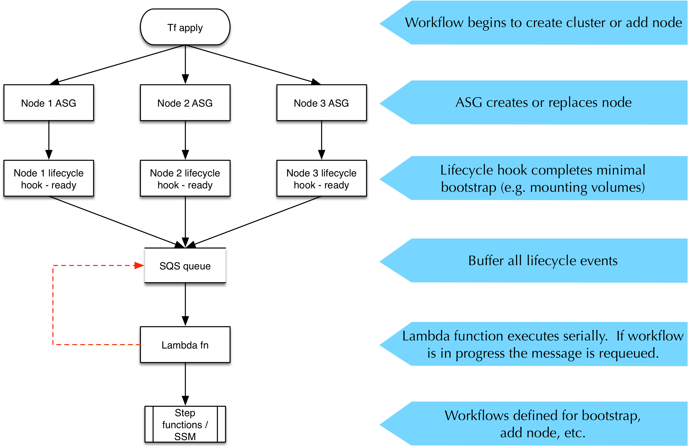
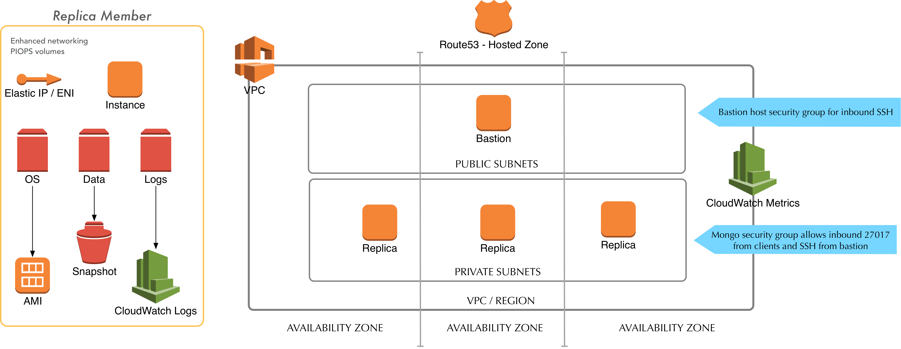
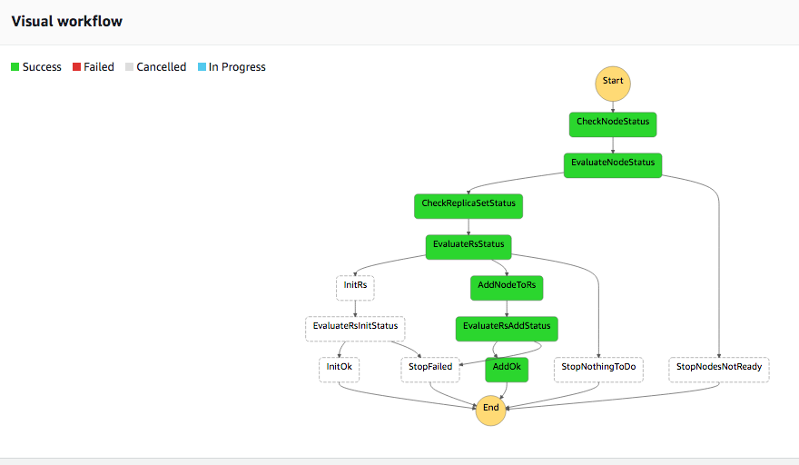

# MongoDB on AWS

// Copyright 2019 Amazon.com, Inc. or its affiliates. All Rights Reserved.
// SPDX-License-Identifier: Apache-2.0

This project builds a highly available MongoDB cluster (replica set) on AWS.

## Status

To date I have verified cluster deployment, scaling a cluster up by adding a new node, and replacing a failed node.

To-do items include:

* Consider additional cluster workflows (e.g. scale down)
* Log retention (pipe Mongo logs to CloudWatch)
* Custom metrics (better health checks on Mongo)
* Error handling (at least send SNS messages on failure)
* Graceful handling of termination events
* Set up Mongo RBAC
* Create the CloudWatch agent document automatically
* Don't have Lamdbda functions wait for SSM docs to complete.

## Deploy

First, create a `local.tfvars` and insert/override any variables of interest.

Next, create an SSM document called `AmazonCloudWatch-mongo` using the JSON in `nodes/cwagent-doc.json`.

Run:

    ./scripts/zip-lambda.sh
    tf init # whenever templates change
    tf apply -var-file="local.tfvars"

## Architecture

We want to deploy a highly available Mongo cluster with automated lifecycle operations.  The basic deployment strategy is described in the Mongo [docs](https://docs.mongodb.com/manual/tutorial/deploy-replica-set/).  We want to manage these lifecycle operations:

* Cluster deployment
* Replacing failed nodes
* Adding new nodes (cluster scaling)
* Backups
* Patching

### Approach

The cluster has a minimum of three nodes.  Lifecycle operations including initial deployment require some knowledge of the overall cluster state.  Initial deployment requires many steps to be executed in the right order.  If a replacement node comes online, we need to know what state the cluster is in, so that we understand what steps to take with the replacement node.

At a high level, we break up the lifecycle into node workflows and cluster workflows.  A node workflow makes sure that the node is ready to begin service.  It configures volumes, installs the necessary Mongo software, and so on.  Finally, the node workflow notifies a queue that it's available.  

The cluster workflows review the state of the nodes and take the necessary actions.  For example, adding a new node requires some actions on the replica set master.  Replacing a failed node may not require any further action.  

We buffer node lifecycle notifications in an SQS queue which triggers a Lambda function.  The function then executes the cluster workflow.  The Lambda function has a [concurrency limit](https://aws.amazon.com/about-aws/whats-new/2017/11/set-concurrency-limits-on-individual-aws-lambda-functions/) of one, which ensures that the workflow is never executed multiple times concurrently.  If the Lambda function finds that a workflow execution is already in progress, the function requeues the notification.

In the following sections we'll go into more detail.

### General design

We deploy the replica set into private subnets in a VPC.  

Each server belongs to its own auto-scaling group.  We use the ASG only for automatically replacing failed nodes, not for scaling a replica set.

We use a Route53 private hosted zone for DNS.  Each server gets either an Elastic IP or a second ENI with a consistent IP address, and we use those static IPs for the A records.

Storage is provided by three PIOPS volumes, with dedicated volumes for data and logs besides the root volume.  The data volume is periodically backed up to S3 via EBS snapshots, while the logs are sent to CloudWatch logs for retention.

We also capture custom MongoDB metrics into CloudWatch metrics.

### SSM Parameters

We use SSM parameters to store and share information about the cluster.

In SSM we organize data for each cluster according to this format:

    /App/Env/Role/...

You can see the parameters for a particular app by:

    aws ssm get-parameters-by-path --path /MongoDB/ --recursive

For example, here's an entry showing the log volume information for a config server:

     {
            "Name": "/MongoDB/Test/config/logsvol/0",
            "Type": "String",
            "Value": "vol-0468d6da3e22b28bb",
            "Version": 1,
            "LastModifiedDate": 1544466509.42,
            "ARN": "arn:aws:ssm:us-west-2:111111111111:parameter/MongoDB/Test/config/logsvol/0"
    }

### Workflows

Our workflows are implemented as Step Function workflows and SSM automation documents, with SQS and Lambda used for decoupling.  Infrastructure provisioning is done by Terraform, as it supports a count/index paradigm to let us create multiple copies of some resources.

We implement more complex lifecycle workflows as Step Functions, and try to restrict SSM automation to single purpose executions.  

#### Node bootstrap

When a new node is launched by the ASG, the ASG sends a notification containing information about the node's project, environment, role, and unique identifier, to an SNS topic, which in turn triggers a Lambda function.  The Lambda function invokes an SSM automation workflow.

The automation document handles attaching the ENI and data volumes, then executes an Ansible playbook to handle the rest of the node setup.

Upon completion, the last step in the SSM execution is to send a message to an SQS queue.  I thought about using a FIFO queue, but I realized that the order didn't really matter; the workflow should be idempotent anyway.  If that assumption proves faulty, we will have to use a Kinesis stream, as you can't trigger a Lambda function from a FIFO queue.

#### Cluster bootstrap

When the cluster workflow (another SSM automation document) executes, it reviews the current state of the cluster.  If it finds that the cluster as a whole is not set up, it checks to see if all the nodes are ready.  If not, it exits and waits for the next node notification.  Once all the nodes are ready, it goes through cluster bootstrap.

#### Replacing a node

A failed node will be replaced by an ASG.  When it boots it'll attach the right ENI and volumes.  The cluster workflow will then see that the node was replaced and make sure that it is being integrated into the cluster correctly.

#### Adding a new node

A new node will be added by an ASG.  When it boots it'll attach the new ENI and volumes, and try to recover the data volume from the latest relevant snapshot.  The cluster workflow will then see that the node was added and add it to the right replica set.

#### Backups

We use Data Lifecycle Manager to automate snapshots of the EBS volumes.

#### Patching

We use SSM patch schedules to perform routine patching, one replica set member at a time.

### Error handling

For now, any conditions that the workflow cannot handle are sent to an SNS topic for operator notification.

## Debugging

### Simulating lifecycle hook

Create a test event for the lifecycle Lambda function.  Use this template for the event:

    { "Records": [ { "EventSource": "aws:sns", "EventVersion": "1.0", "EventSubscriptionArn": "arn:aws:sns:us-west-2:111111111111:lifecycle-topic-20190105234944240200000001:094af09e-c542-430d-85a1-6c60f603ff52", "Sns": { "Type": "Notification", "MessageId": "90c5fe10-4e0a-58c1-976b-aabd25b0a514", "TopicArn": "arn:aws:sns:us-west-2:111111111111:lifecycle-topic-20190105234944240200000001", "Subject": "Auto Scaling:  Lifecycle action 'LAUNCHING' for instance i-080229cc245f8f968 in progress.", "Message": "{\"LifecycleHookName\":\"rs_instance_launch\",\"AccountId\":\"111111111111\",\"RequestId\":\"d595a0a3-4e05-12de-8512-2de8e15153bc\",\"LifecycleTransition\":\"autoscaling:EC2_INSTANCE_LAUNCHING\",\"AutoScalingGroupName\":\"rsmember-asg-2019010523501546760000001c\",\"Service\":\"AWS Auto Scaling\",\"Time\":\"2019-01-07T15:00:10.031Z\",\"EC2InstanceId\":\"i-080229cc245f8f968\",\"NotificationMetadata\":\"{\\n  \\\"role\\\": \\\"rsmember\\\",\\n  \\\"id\\\": \\\"2\\\",\\n  \\\"project\\\": \\\"MongoDB\\\",\\n  \\\"environment\\\": \\\"Test\\\"\\n}\\n\",\"LifecycleActionToken\":\"TEST\"}", "Timestamp": "2019-01-07T15:00:10.063Z", "SignatureVersion": "1", "Signature": "Q0x0jgWir7ah3y+2azlDDeGD5Mw7aXbcO3fRDfjYgtmBfif9Vzr1bv6GZtIHXtWlVpcuGNyvGH6jcO0Y+rncFUP4hQQjmuIxCshriB8PzItK7664fxuZbhbeCEGSPQ5IlL2CkzDxQz28Tj3OfQ/YD1Uh/fHU4e5ABQ22wv2cR83Hu958aQIzFbPD/jAfgmd3CXPSNRTq74Z1GGgUA6YLJfayLzpMjbT14xH17Kj9INmwKpZFfqhDRH7N+3jvRa9eCISBqjNYIyudyP/m8oUmnw8Zzh5s8qhcNiL9o+2b5sSUKmpl7oVr4MSTgLX+ge4AYdWUN4RWdvj1e8Nn9ZUNfQ==", "SigningCertUrl": "https://sns.us-west-2.amazonaws.com/SimpleNotificationService-ac565b8b1a6c5d002d285f9598aa1d9b.pem", "UnsubscribeUrl": "https://sns.us-west-2.amazonaws.com/?Action=Unsubscribe&SubscriptionArn=arn:aws:sns:us-west-2:111111111111:lifecycle-topic-20190105234944240200000001:094af09e-c542-430d-85a1-6c60f603ff52", "MessageAttributes": {} } } ] }

Replace parameters as appropriate:

    * EC2InstanceId
    * role
    * id
    * project
    * environment
    * LifecycleActionToken (set to `test` to avoid sending completion action)

### Simulating workflow

Create a test event for the workflow Lambda function with this template:

    { "Records": [ { "messageId": "d65e655a-6339-4768-9459-07b1ca933120", "receiptHandle": "AQEBXJTB93lSP8uJtUmgI6TN6IWkELicH0jSrICC3i+DZUM65Vf2RO3iQAySfexQxFW6GsKN5ofmTtPkDM8G+l2KNmOp3F52jGsZld5fCgnBSvDOAHdtRd9yBJv/HjWOIE/aXgfe4zb9GRcziCt9FkmnQKaUxt0wLe8+Bb+YkGwshf1Y+LEmdmceIjkfNePFjysBCvpoGefRfIPLjpU6LMsybx7/mG8bXgr2Nr+hDlljqYixwqJp/BJIfZqIpZ2aUUKFweaGbo8LYWCF51ixNvze9zbDsPNZ+YzpyG+HQQYQ0ICuVxMCH9IwUKNQhmbzCurSP3cyHwSbA6FOyXg+jfyhoRaRYhguYi9HFXOoxdhmjyeurcHieY8shTNKvag78j4dMbsjgtlXwge3dIsZlbdqRL2IOKR4kzRpal0V/nPDa0fQFvUFAdXOsROSuCG0wO8W", "body": "Ready", "attributes": { "ApproximateReceiveCount": "1", "SentTimestamp": "1546873726456", "SenderId": "AROAIKPTMME6GO2HWBGU6:d1d5e3bf-04a3-458f-99cc-c1d2c5823e40", "ApproximateFirstReceiveTimestamp": "1546873726469" }, "messageAttributes": { "Role": { "stringValue": "rsmember", "stringListValues": [], "binaryListValues": [], "dataType": "String" }, "Project": { "stringValue": "MongoDB", "stringListValues": [], "binaryListValues": [], "dataType": "String" }, "Environment": { "stringValue": "Test", "stringListValues": [], "binaryListValues": [], "dataType": "String" }, "ID": { "stringValue": "2", "stringListValues": [], "binaryListValues": [], "dataType": "String" } }, "md5OfMessageAttributes": "fe319407a0ecdbf4db19bb3203221fcb", "md5OfBody": "e7d31fc0602fb2ede144d18cdffd816b", "eventSource": "aws:sqs", "eventSourceARN": "arn:aws:sqs:us-west-2:111111111111:lifecycle-queue-20190105234945316100000004", "awsRegion": "us-west-2" } ] }

## References

* [MongoDB Quick Start](https://docs.aws.amazon.com/quickstart/latest/mongodb/architecture.html)
* [Mongon HA](https://eladnava.com/deploy-a-highly-available-mongodb-replica-set-on-aws/)
* [CFN](https://github.com/adoreboard/aws-cloudformation-templates)
* [Sharded cluster notes](https://stackoverflow.com/questions/30790038/mongodb-cluster-with-aws-cloud-formation-and-auto-scaling)
* [Deploying sharded cluster](https://docs.mongodb.com/manual/tutorial/deploy-shard-cluster/)
* [Expanding replica set](https://docs.mongodb.com/manual/tutorial/expand-replica-set/)
